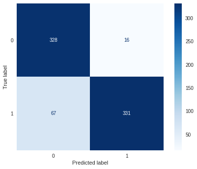

# College Placement Model
## Using machine learning models to see how well college placement can be predicted.

**Kutlukkhan Alikhanov**

### Description:
Various classification models and feature engineering techniques were tested against the dataset to see which performed the best based on multiple different metrics. 

### Source:
[Data Source.](https://www.kaggle.com/datasets/tejashvi14/engineering-placements-prediction?select=collegePlace.csv)

### Results:
The best model ended up being a random forest model where PCA was not used.

#### Metrics:
- Accuracy: 0.88814
- Recall: 0.83165
- Precision: 0.95389
- ROC AUC Score: 0.93606
- Confusion Matrix:

### Use case:
The model could be useful for the college to understand what students are likely to be placed. It could also help speed up the placement process. The model is tuned based on the data so this model is only reliable on the same college. As such it is most likely a lot less effective if it would be tested on data from a different college, making it less useful to them.
