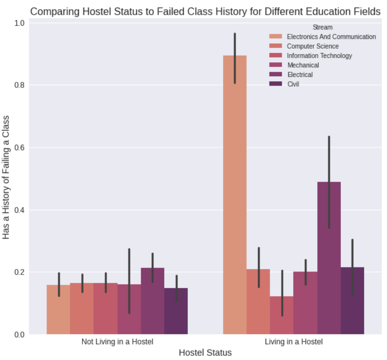
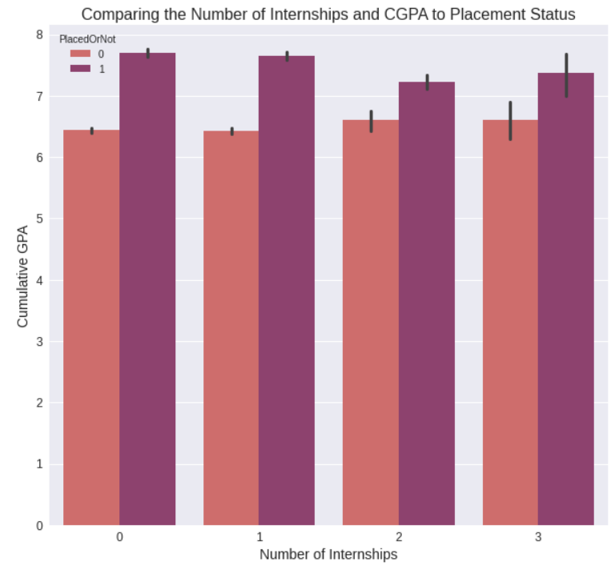

# College Placement Model
## Using machine learning models to see how well college placement can be predicted.

**Kutlukkhan Alikhanov**

### Description:
Various classification models and feature engineering techniques were tested against the dataset to see which performed the best based on multiple different metrics. 

### Source:
[Data Source.](https://www.kaggle.com/datasets/tejashvi14/engineering-placements-prediction?select=collegePlace.csv)

### About the Data:
The data consists of 2966 rows and 8 columns. In the data there is some basic information such as age, gender, and cumulative GPA. There is also more inteesting data such as number of internships, whether or not the student lives in a hostel, or has a history of failing a class, whether or not they got placed, what stream they are in. Stream stands for Science, Technology, Religion, Engineering, Arts and Mathematics, and basically equates to their education field. This data is specifically on the engineering course at this college which explains why the different education fields present are what they are. You might ask yourself, what is placement? Students who are at the end of their college degree have chances to get a job from a partnership between the college and a company, landing this job is placement.

### Results:
The best model ended up being a random forest model where PCA was not used.

#### Metrics:
- Accuracy: 0.88814
- Recall: 0.83165
- Precision: 0.95389
- ROC AUC Score: 0.93606
- Confusion Matrix:

### Metrics and how they matter.
In the model chosen we can see a precision of ~0.95 or 95% and a recall of ~0.83 or 83%. Both of these metrics are relevant for our model but making a distinction helps us understand what is happening. 
#### Precision:
We can see that our precision is very high, this means that of those that the model decides wil place 95% of the time the decision is correct, the other 5% the model chooses a student to get placed and it ends up that they did not. This metric is great for our model, it means that when it decides a student is placed the decision is correct a vast majority of the time. Considering what the data is this high level of precision is likely optimal. It is very possible that the 5% the model placed incorrectly could have other external factors that prevented them from being placed. Of those the model chose as placed 95% of the time it is correct.
#### Recall:
The recall for our model is lower than our precision. This means that our model correctly determined ~83% of the total placed students. This metric is different from precision in that it includes those the model says would not be placed but in fact were. It is expected that recall will be lower than precision as it is comparing the same value (true positive) to a larger pool.
#### Which is more important?
Honestly they are both important, both metrics would serve a purpose if the college/company were to employ a machine learning model. For example A high precision is good because it means that when the model predicts that someone will be placed it is likely that they are, this metric however really stands out when combined with recall. Recall shows on how much of total relevant data was the model correct, not just of those that it chose. If we only had precision the model could predict only a small handful of students and have a high precision. However, this type of model is relatively useless if there is a much bigger pool of candidates and the model is only choosing a small albeit relatively correct portion. In conjunction with recall we can see that our model is not only correct on those that it predicts, but that it predicts a vast majority of the total placed students.
#### False positives/ negatives:
Which is more harmful? It depends on who wants to use the model. If the college wants to use the model then they want to have as little false positives as possible to cost them the least amount of money. If the model was to be used for students they would want as little false negatives as possible. We can assume that the model will be used by the college/ company rather than the students. This is great because our model has fewer false positives compared to false negatives. 

### Barplot of the Likelihood of Having a History of Failing a Class Using Hostel Status for Various Education Fields

#### Visualization analysis:
> This visualization compares hostel status to whether or not a history of failing a class is present, it then further splits this comparison by respective education fields. This visualization is hard to explain in words because it uses three different qualitative data groups, but visually it still works fine. In this visualization we can see that there are some interesting trends. Those living in a hostel in the Electronics and Communication field are disproportionately more likely to have a history of failing a class. The same is true for the electrical field but to a lesser degree. It is also worht noting that in the Information Teeldchnology field for those living in a hostel it is the most unikely that they have failed a class in the past.

### Barplot Comparing Cumulative GPA and Number of Internships to Placement status.

#### Visualization analysis:
> This visualization compares the number of internships to the cumulative GPA of students, it then splits this comparison further with placement status. A trend we can see is that the cumulative GPA of those placed is higher than those not placed regardless of the amount of internships. Interestingly as the amount of internships increases the average cumulative GPA of those placed becomes lower and the average GPA of those not placed gets higher. However, if you think about what this means logically it makes sense. 

### Use case:
The model could be useful for the college to understand what students are likely to be placed. It could also help speed up the placement process. The model is tuned based on the data so this model is only reliable on the same college. As such it is most likely a lot less effective if it would be tested on data from a different college, making it less useful to them.
