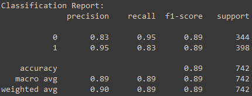

# College Placement Model
## Using machine learning models to see how well college placement can be predicted.

**Kutlukkhan Alikhanov**

### Description:
Various classification models and feature engineering techniques were tested against the dataset to see which performed the best based on multiple different metrics. 

### Source:
[Data Source.](https://www.kaggle.com/datasets/tejashvi14/engineering-placements-prediction?select=collegePlace.csv)

### Results:
The best model ended up being a random forest model where PCA was not used.

#### Metrics:
- Accuracy: 0.88814
- Recall: 0.83165
- Precision: 0.95389
- ROC AUC Score: 0.93606

